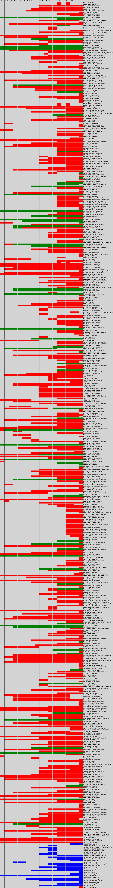

<<<<<<< HEAD

This is a class browser for the Objective-C runtime on Mac OS X. It gives you full access to all classes loaded in the runtime; allows you to dynamically load new modules and their classes; shows every method implemented on each class; and displays information in a header (.h) file format.

We have found this to be a useful development tool. Please note, however, that each user is responsible for their own usage.

The [original version](http://www.prajnait.com/source/src_RuntimeBrowser.html) was released in April 2002 by Ezra Epstein. The project is maintained by Nicolas Seriot since August, 2008.

The OS X version features:

  * browse by class tree, image or indexed list
  * search in classes contents
  * syntax colorization
  * drag and drop frameworks and headers
  
Latest build: [http://seriot.ch/temp/runtimebrowser.zip](http://seriot.ch/temp/runtimebrowser.zip)

The iOS version features:

  * browse by class tree, image or indexed list
  * search in classes names
  * headers retrieval through HTTP
  * instantiations and basic methods invocations at runtime

You can browse the [iOS headers](https://github.com/nst/iOS-Runtime-Headers) as seen by RuntimeBrowser.

=======
## Dynamically Generated iOS Headers

Here are iOS Objective-C headers as derived from runtime introspection.

The headers were generated using [RuntimeBrowser for iPhone](https://github.com/nst/RuntimeBrowser/).

#### Search

You can search the headers with [github search](https://github.com/search):

[https://github.com/search?type=Code&q=repo:nst/iOS-Runtime-Headers+hack](https://github.com/search?type=Code&q=repo:nst/iOS-Runtime-Headers+hack)

#### Diffs

You can compare versions based on their tags, see the [tags page](https://github.com/nst/iOS-Runtime-Headers/tags):

    $ git difftool 6.0 6.1 .

#### Sample usage

You can use the headers this way:

    NSBundle *b = [NSBundle bundleWithPath:@"/System/Library/PrivateFrameworks/FTServices.framework"];
    BOOL success = [b load];
    
    Class FTDeviceSupport = NSClassFromString(@"FTDeviceSupport");
    id si = [FTDeviceSupport valueForKey:@"sharedInstance"];
    
    NSLog(@"-- %@", [si valueForKey:@"deviceColor"]);
    
#### Timeline

- Green == public
- Red == private
- Blue == dylib

The code to draw this picture is in [https://github.com/nst/RuntimeBrowser/tree/master/tools/ios_headers_history](https://github.com/nst/RuntimeBrowser/tree/master/tools/ios_headers_history).

Nicolas Seriot
>>>>>>> upstream/master
